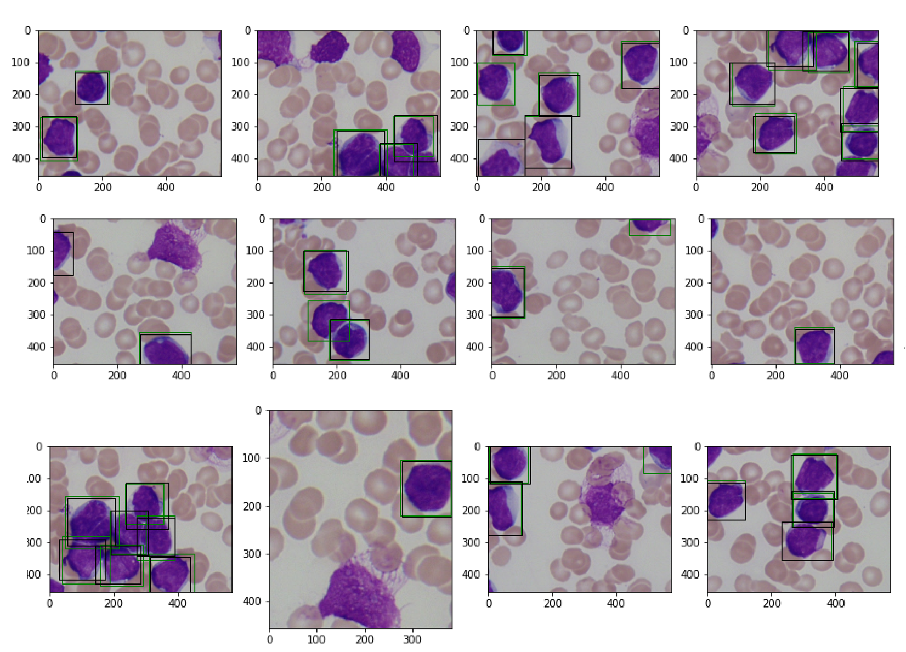
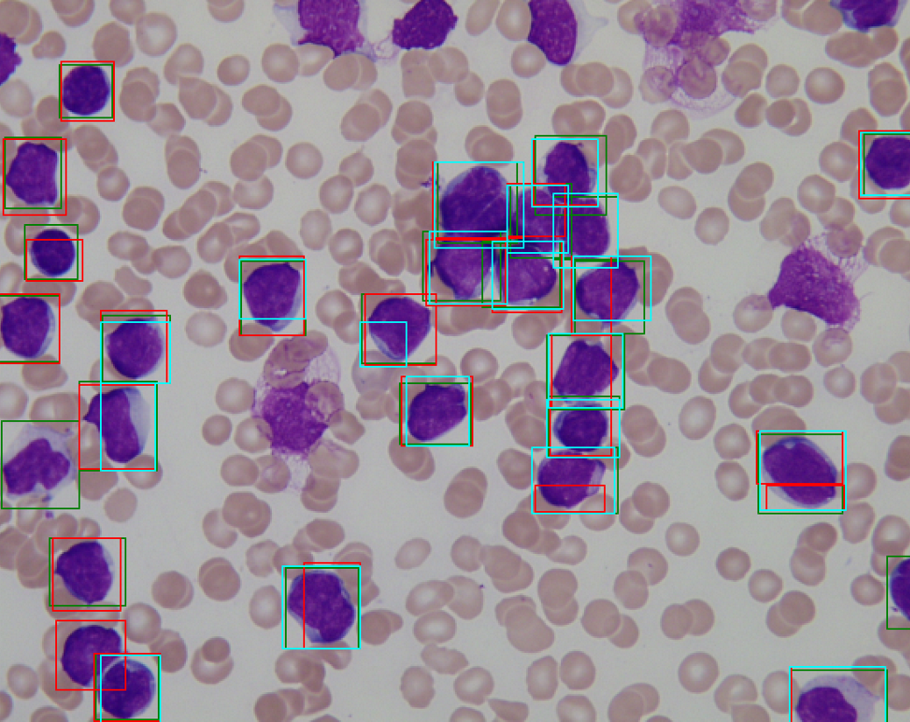
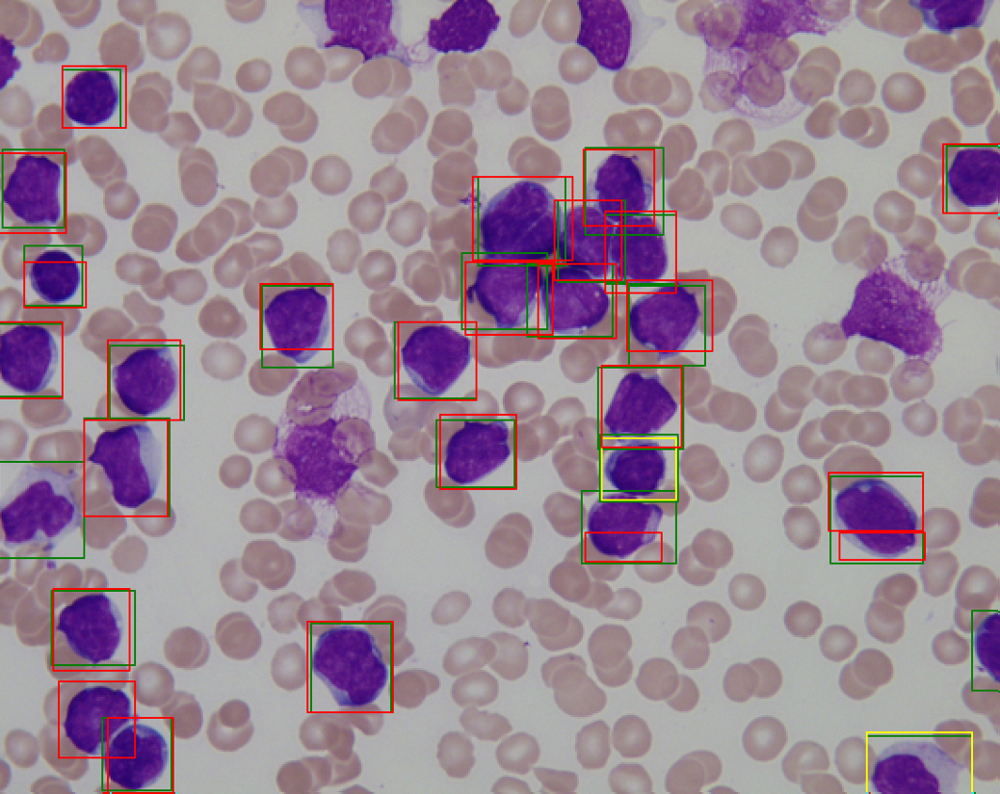
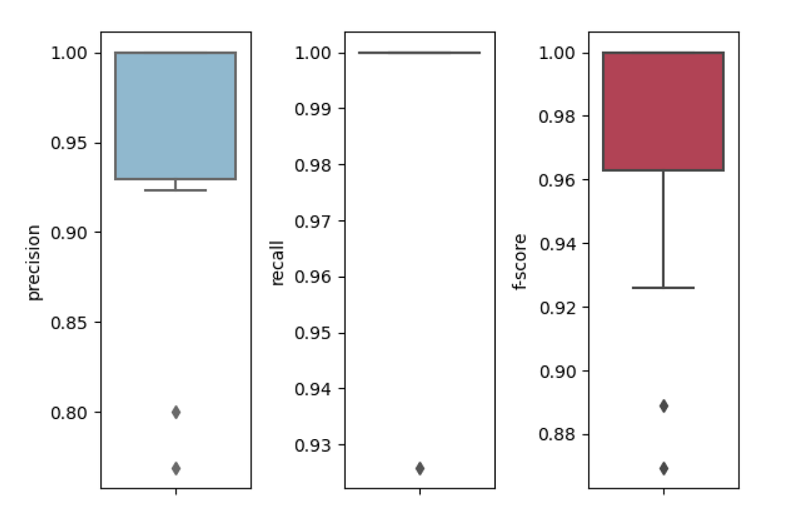
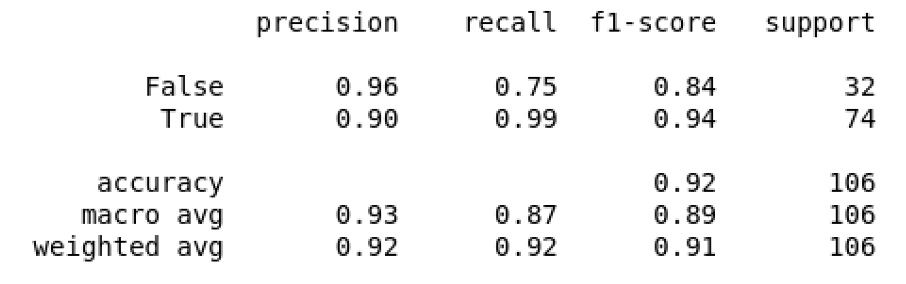

# Leukemia Detection Algorithm
This repository contains a model trained and API developed to detect Leukemia in children

Training for this model was done using Arkangel AI's development tool 'Hippocrates' which trains different architectures and configurations to get the best possible performance out of a convolutional neural network for a given problem. This repository contains models trained on a section of the dataset: https://www.kaggle.com/andrewmvd/leukemia-classification

This repository contains the best model so far in format .h5, this model was validated under a hold out scheme by joining training and validation cohorts from the dataset and splitting this merged set into train, test and validation samples respectively. As a result, performance metrics for the test cohort are:

* Accuracy: 0.94
* Area Under the ROC Curve: 0.98
* Sensitivity: 0.95
* Specificity: 0.93
* F1-macro: 0.93

### TO RUN IT:

* Access this collab: https://colab.research.google.com/github/arkangelai/leukemia-cell-classification/blob/main/Leukemia-classification-api-test_colab.ipynb
* Choose one of our sample image or upload yours.
* Get a prediction.

### New features:

* Improved the precision metrics of the algorithm
* Supports automatic segmentation of lymphocytes from a raw data
* Build an API that handles the whole detection pipeline

### Prediction pipeline:
The following process is performed to detect and predict lymphocites in thin blood smears:
* A tiling algorithm using a 3x3 grid with repetition with an offset, this results in 9 tiles per image without offset and other 9 tiles by translating the grid.
* Screening each tile by using a classifier i.e predicting whether each tile is going to be fed to our object detection model or if it is discarded as it is not likely to contain any relevant WBC structure.
* Detection of WBC structures by using our trained YoloV3 algorithm.
* Classification of each detected bounding-box with a second classifier that distinguishes between lymphocites and leukoblasts.

the following images illustrate the process:

YOLO detection for generated tiles at the first step of the proposed pipeline. Ground truth boxes are presented in black whereas detected boxes are displayed in green.

Grid offset benefit illustration: In this example detections are presented in red and cyan, where the red bounding boxes correspond to the original grid whereas the ones in cyan correspond to the grid with an offset.

This example illustrates a given detection with classification. Color codes are as follows: green corresponds to ground truth, yellow to WBC and red to Leukoblast

Detection performance statistics: This figure shows object detection performance across all subjects from the testing cohort.

Classification performance metrics.

### Contributing
The main purpose of this repository is to continue evolving the Leukemia core, making it faster and easier to use. Development of the model happens in the open on GitHub, and we are grateful to the community for contributing bugfixes and improvements. Read below to learn how you can take part in improving the solution.

#### Code of Conduct
Arkangel AI has adopted a Code of Conduct that we expect project participants to adhere to.

#### Contributing Guide
Read our contributing guide to learn about our development process, how to propose bugfixes and improvements, and how to build and test your changes to the model.

#### Good First Issues
To help you get your feet wet and get you familiar with our contribution process, we have a list of good first issues that contain bugs which have a relatively limited scope. This is a great place to get started.

#### License
This project is MIT licensed.

